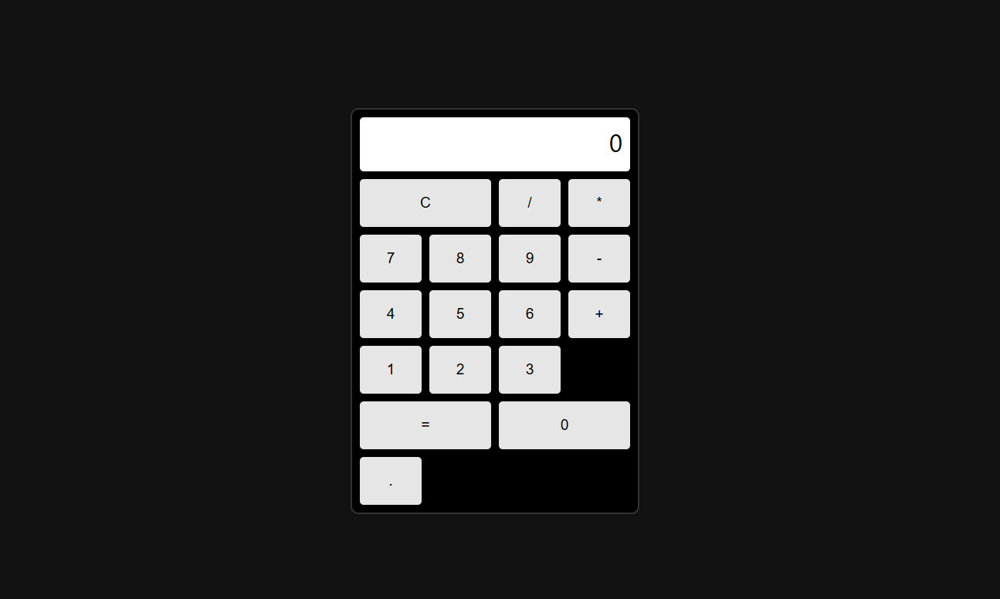
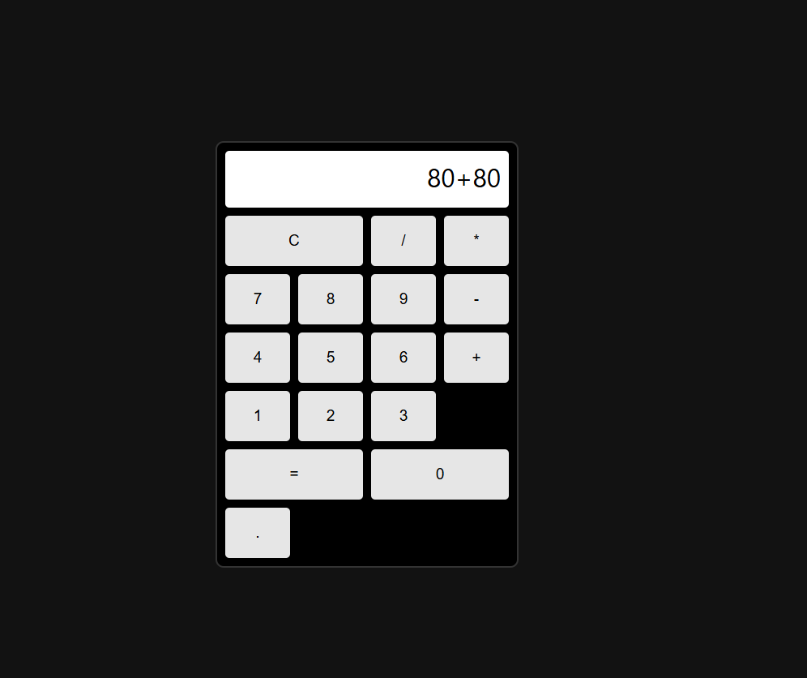

React Simple Calculator 

English | [Ελληνικά](README_GR.md)
A simple calculator application built with React using functional components and React Hooks.

The application allows users to perform basic arithmetic operations such as addition, subtraction, multiplication, and division through a clean and responsive interface.

Features
Basic arithmetic operations (+ − × ÷)
Clear input functionality
Responsive calculator layout using CSS Grid
Built with React functional components
Uses React Hooks (useState) for state management
Error handling for invalid expressions
Technologies Used
React
JavaScript (ES6)
HTML5
CSS3
React Hooks
Project Structure
project1-calculator
│
├── src
│   ├── Calculator.js
│   ├── Calculator.css
│   ├── App.js
│   └── index.js
│
├── public
│
└── package.json
How It Works

The calculator stores the current input inside a state variable.

const [input, setInput] = useState("");

When a button is clicked, the value is appended to the current input.

const handleClick = (value) => {
  setInput((prev) => prev + value);
};

When the equals button is pressed, the expression is evaluated and the result is displayed.

setInput(eval(input).toString());

If the expression is invalid, the calculator shows an error message.

Installation and Setup
Clone the repository
git clone https://github.com/thanos-coder2/react-simple-calculator.git
Navigate into the project folder
cd react-calculator
Install dependencies
npm install
Run the development server
npm start

The application will start at:

http://localhost:3000
Future Improvements

Possible improvements for this project:

Replace eval() with a safer math parser
Add keyboard support
Add scientific calculator functions
Improve mobile responsiveness
Add animations or UI enhancements

# React Simple Calculator

[English](README.md) | Ελληνικά

---

